# n8n Support Desk — Gmail + live chat, one shared brain

Four n8n workflows that answer a small business's support mail and its website
chat from the same knowledge base, in the same voice, with the same rules about
what a bot is not allowed to answer. Genuine support email gets a reply in its
own Gmail thread; everything else gets labelled and routed out rather than
dropped; anything the desk cannot ground in the business's own content goes to a
human and gets written down as an article somebody needs to write.

Built for n8n **2.40.5** and Postgres **17.6**. Every workflow in `workflows/`
was imported into a real n8n instance, executed, screenshotted and recorded — the
images and the video below are that instance, not mockups.

---

## The four workflows

| File | Trigger | What it does |
|---|---|---|
| [`01-email-support-agent.json`](workflows/01-email-support-agent.json) | Gmail Trigger, every minute | Captures **sender, subject, body, threadId** and both message ids explicitly. Claims the message against a unique constraint so a redelivery cannot reply twice. Classifies support-vs-not with a strict JSON schema plus a deterministic keyword sweep that can only add caution. Non-support mail is **labelled and logged**, not dropped. Support mail goes to the shared answer engine and comes back as a reply **in the same thread**, or — if the answer is not grounded, not confident enough, or touches money — as a labelled handover with a ticket and a Slack alert. 27 nodes. |
| [`02-live-chat-agent.json`](workflows/02-live-chat-agent.json) | Webhook `POST /webhook/chat/message` | Verifies a shared secret in constant time, loads the last N turns of the session out of Postgres so the conversation has memory, calls the **same** answer engine, and returns the answer in the body of the visitor's own POST. Bookkeeping — the decision log, the transcript, the ticket, the alert — all happens after the browser already has its reply. 19 nodes. |
| [`03-answer-engine.json`](workflows/03-answer-engine.json) | Execute Workflow | The shared backend. Postgres full-text search over the business's articles, `ts_rank`-ordered, floored; the model is handed the retrieved passages and nothing else; every citation it returns is filtered against what was actually retrieved before the answer counts as grounded. When nothing matches, that is a documented outcome that writes a row to `unanswered_questions` — the knowledge base's own to-do list. 15 nodes. |
| [`04-error-trigger-alerts.json`](workflows/04-error-trigger-alerts.json) | Error Trigger | Fires whenever any of the above fails. Posts the workflow, the failing node, the error, the item that was in flight and a link to the execution, then writes the failure to a table whether or not Slack accepted the message. 4 nodes. |

All plain `n8n-nodes-base` nodes — no community packages, nothing to install.

**"Connected to the same backend" is literal.** Workflows 01 and 02 both call
workflow 03 by id. Not a copy of the logic, not a shared prompt pasted twice —
the same workflow. Add an article, change the prompt, move the relevance floor,
and both channels change together. `test/validate.mjs` fails the build if either
one ever grows an answering path of its own.

---

## Proof it runs

`docs/screenshots/` is a real n8n 2.40.5 instance on Postgres 17.6, started from
`infra/docker-compose.yml`, with these four files imported by
`n8n import:workflow --separate`. Twenty-two executions:

| # | Workflow | Mode | Result | Time |
|---|---|---|---|---|
| 1 | 01 Email Support Agent | trigger | success — 2FA question answered from article 9, replied in-thread | 467 ms |
| 3 | 01 Email Support Agent | trigger | success — newsletter labelled `Support/Not-Support`, no reply | 136 ms |
| 4 | 01 Email Support Agent | trigger | success — follow-up on the same thread, history loaded | 395 ms |
| 6 | 01 Email Support Agent | trigger | success — no article matched, handed to a human, gap recorded | 325 ms |
| 8 | 01 Email Support Agent | trigger | success — refund request held for a human despite a grounded answer | 270 ms |
| 10 | 02 Live Chat Agent | webhook | success — answered in the response to its own POST | 189 ms |
| 14 | 02 Live Chat Agent | webhook | success — follow-up answered from session memory | 396 ms |
| 16 | 02 Live Chat Agent | webhook | success **after two HTTP 500s** — retried and recovered | 4233 ms |
| 18 | 02 Live Chat Agent | webhook | **error** — model returned an HTML error page, nothing invented | 131 ms |
| 19 | 03 Answer Engine | integrated | **error** — the validator refused the response | 63 ms |
| 21 | 04 Error Trigger | **error** | success — alerted and recorded the failure of execution 18 | 48 ms |
| 22 | 01 Email Support Agent | trigger | success — duplicate delivery, exactly one reply still | 79 ms |

(Executions 2, 5, 7, 9, 11, 13, 15 and 17 are the answer engine running as a
sub-workflow of the rows above; 20 is the Error Trigger firing for execution 19.)

<p align="center">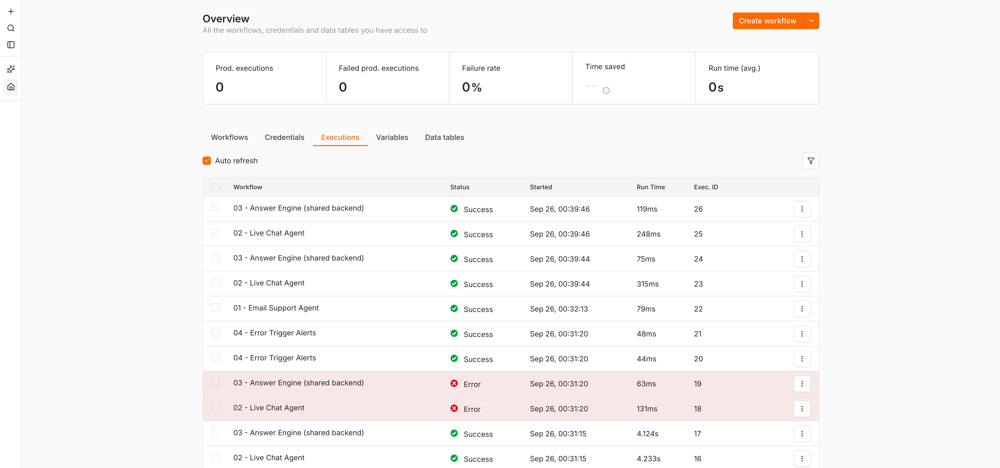</p>

**A question answered from the business, not from the model.** The customer asked
how to turn on two-factor authentication. Retrieval found article 9, the model
was given that passage and nothing else, and the four fields the brief names are
visible in the node's own output.

<p align="center">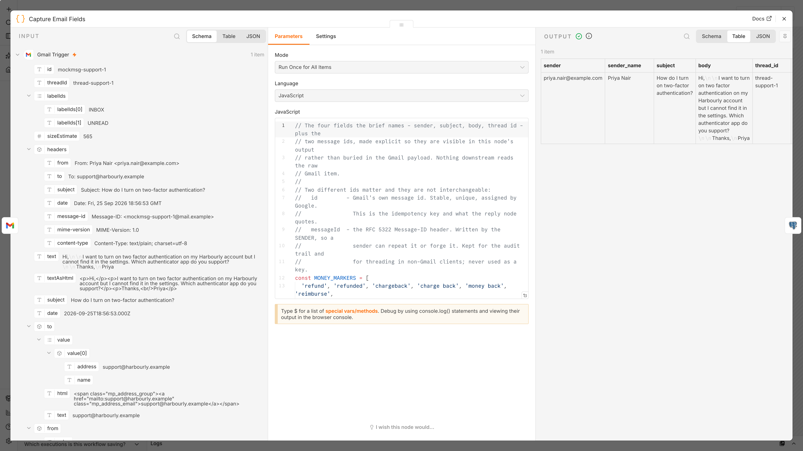</p>
<p align="center">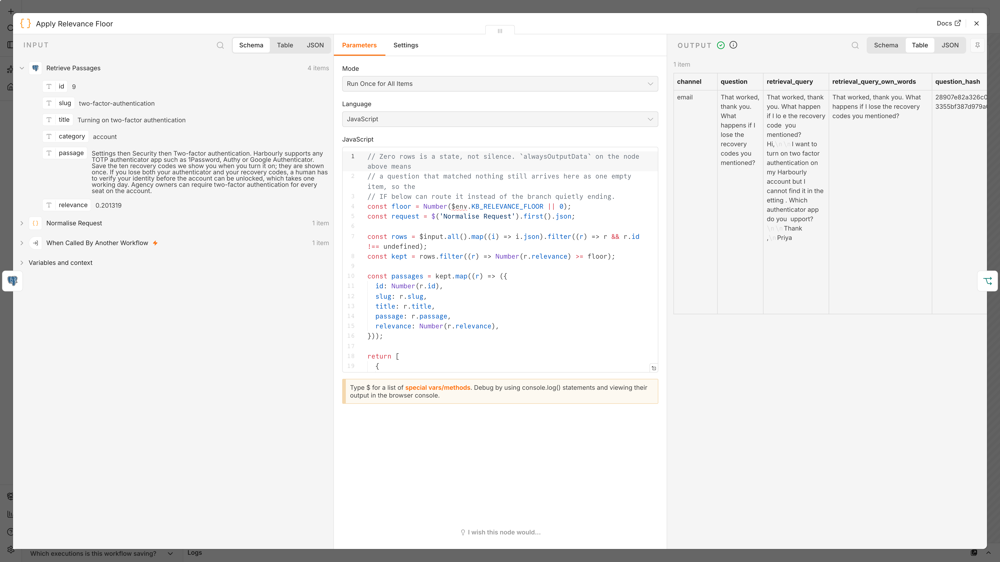</p>

**The reply goes back into the same thread** — and carries the headers that make
it thread in Outlook and Apple Mail too, not only in the Gmail web UI.

```
inbound  threadId   thread-support-1
reply    threadId   thread-support-1
         In-Reply-To  <mockmsg-support-1@mail.example>
         References   <mockmsg-support-1@mail.example>
```

<p align="center">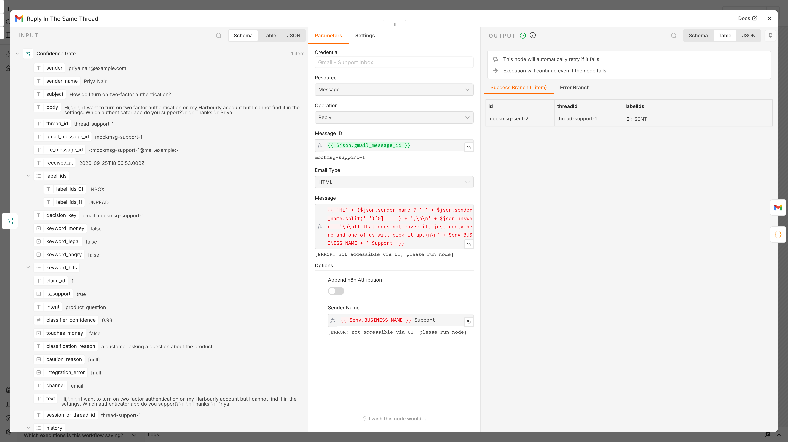</p>

**Non-support is routed out, not deleted.** A newsletter is labelled
`Support/Not-Support`, written to the decision log with the reason, and left in
the mailbox where a human can find it and drag it back.

<p align="center">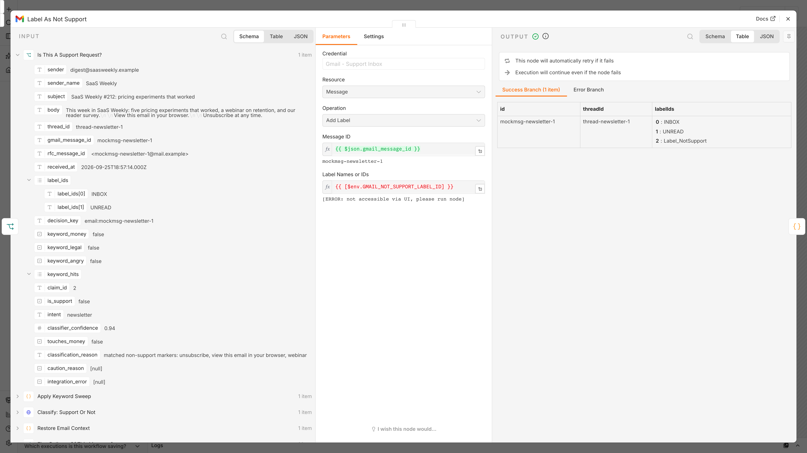</p>

**The gate refuses money regardless of confidence.** Execution 8 is the
interesting one: the engine *did* find a grounded answer in the refund-policy
article, and it was still not sent, because `touches_money` was raised by the
keyword sweep before the model was asked anything.

<p align="center">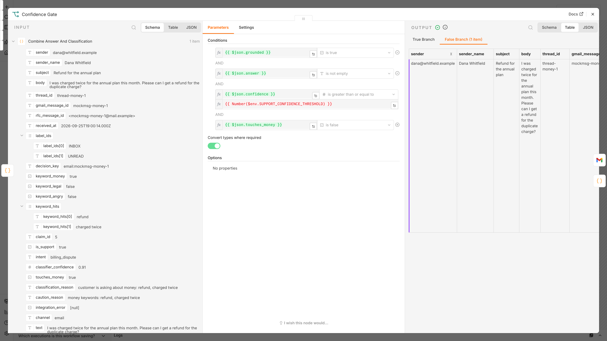</p>

**Missing knowledge is a feature.** Nothing in the help centre covers Android
receipt scanning, so nothing was answered, the question went into
`unanswered_questions`, the mail was labelled `Support/Needs-Human`, a ticket was
opened and Slack was told.

<p align="center">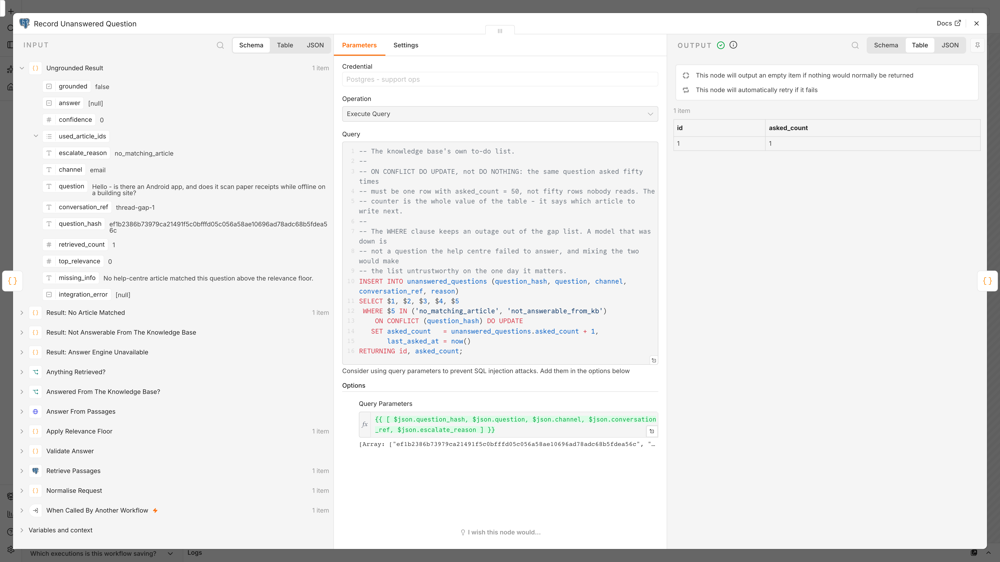</p>

**Nothing fails quietly.** A model endpoint answering `200 text/html` is the
failure no retry can fix. The validator refused it, the execution failed, and
workflow 04 wrote both rows.

<p align="center">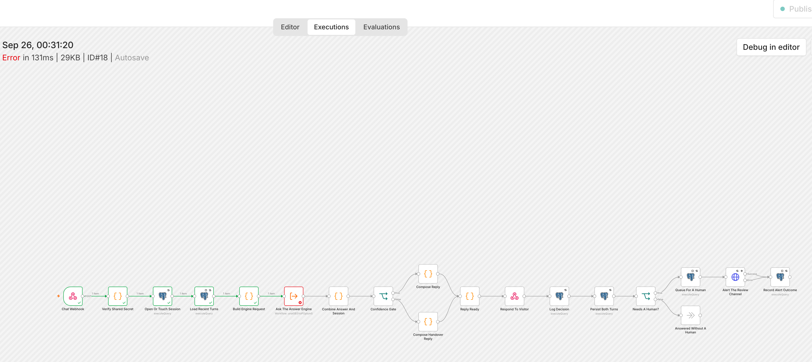</p>
<p align="center">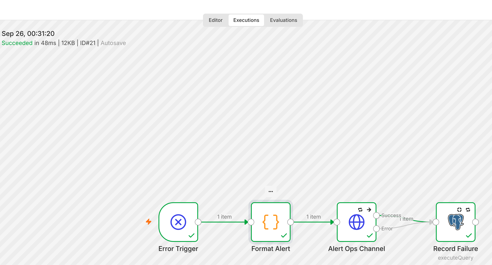</p>

**A duplicate exits in 79 ms with nothing to show for it**, which is exactly
right.

<p align="center">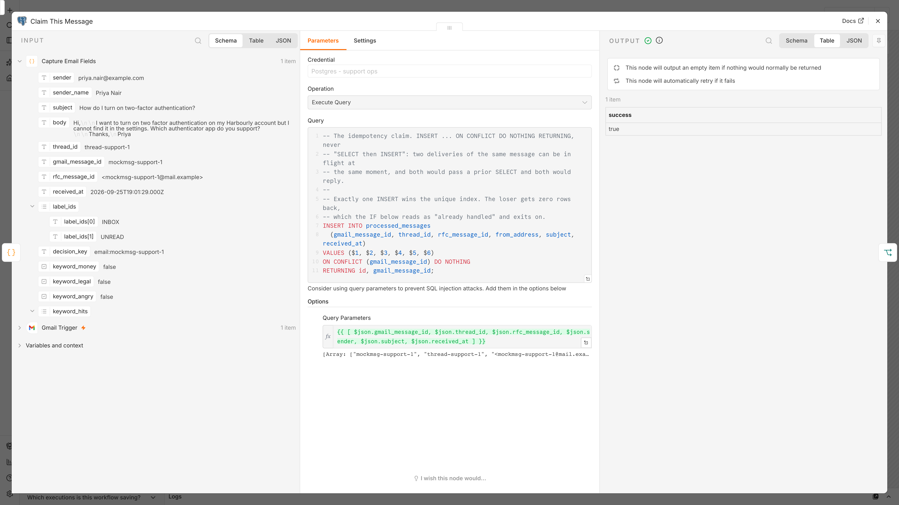</p>

**The widget, answering live** on `widget/demo.html` — the round-trip time under
each reply is printed by the widget itself.

<p align="center">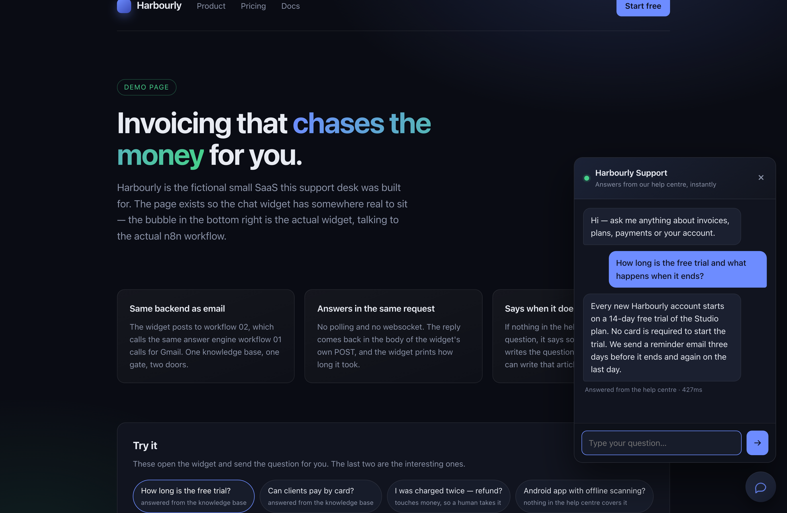</p>
<p align="center">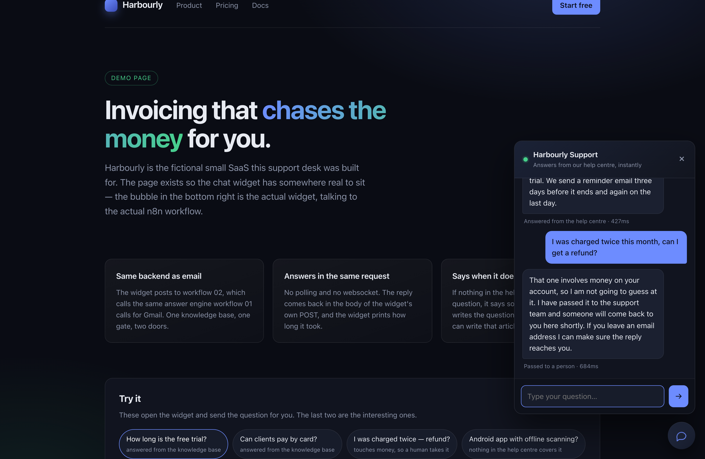</p>

### Walkthrough video

**[`docs/walkthrough.mp4`](docs/walkthrough.mp4)** — 2m 47s, recorded in one
take against the same instance: the executions list, a support email delivered
live and answered in its own thread, the widget answering three questions on
`widget/demo.html` while the Gmail poll runs down, the answer engine's retrieval
with real `ts_rank` numbers, and the same Gmail message id delivered a second
time exiting cleanly on the idempotency claim.

What the database held afterwards:

```
support_desk_daily
 channel │ messages │ auto_replied │ handed_to_human │ routed_out │ deflection_pct │ avg_confidence
 chat    │        4 │            3 │               1 │          0 │           75.0 │          0.713
 email   │        5 │            2 │               2 │          1 │           50.0 │          0.542

kb_gaps
 "And what does it cost after that?"                                    chat   asked 1×
 "Hello - is there an Android app, and does it scan paper receipts …"   email  asked 1×
```

---

## What was mocked, and what was not

Every node, expression, query and Code node in `workflows/` ran exactly as
committed. Three things were filled in at import time, and they are the same
three things any n8n user fills in on their own instance: the three credential
ids (the files ship `"id": null` so no instance id leaks into the repo), the real
id of workflow 04 in place of `REPLACE_WITH_WORKFLOW_04_ID`, and the real id of
workflow 03 in place of `REPLACE_WITH_ANSWER_ENGINE_ID`. Everything else that
differs from a live business is the value of an environment variable.

| Real in the screenshots | Mocked |
|---|---|
| n8n 2.40.5, Postgres 17.6, in Docker | The Gmail API (`/gmail/v1/users/me/…`) and Google's OAuth token endpoint |
| The Gmail Trigger and the Gmail node, polling and replying for real | The OpenAI-compatible `/chat/completions` endpoint |
| Every expression, Code node and SQL query in `workflows/` | Slack incoming webhooks |
| The retrieval — real `tsvector`, real GIN index, real `ts_rank` | |
| The confidence gate, the retries, the idempotency constraints | |
| The real Postgres tables in `sql/schema.sql` | |
| The executions, timings, row counts and failures above | |

**The Gmail node is real; the server on the other end of it is not.** n8n's Gmail
Trigger and Gmail node have no base-URL setting — they always call
`https://www.googleapis.com` — so the demo compose overlay maps that name to the
mock container and turns off certificate verification *inside the n8n container
only*. That is the one shortcut in this repo and it is why
`NODE_TLS_REJECT_UNAUTHORIZED` appears in `docker-compose.demo.yml` and nowhere
else. The consequence is that the trigger's polling, its own duplicate handling,
the `format=raw` fetch, the MIME parsing, the `messages/send` call and the
`messages/{id}/modify` label call all executed as written — and the
`In-Reply-To` header quoted above was read back out of the RFC 5322 message the
node actually produced.

**No API key was needed.** Both LLM calls are plain HTTP Request nodes to
`{{ $env.LLM_API_BASE }}/chat/completions` with
`response_format: { type: "json_schema", strict: true }`. The mock returns
schema-valid JSON decided by keyword matching, so the *parsing, validation,
citation filtering, confidence derivation, gating, routing and logging* all ran
for real — only the model's judgement was substituted. Point `LLM_API_BASE` at
`https://api.openai.com/v1`, fill in the credential, and the same workflow calls
OpenAI. Nothing else changes; the same is true for Azure OpenAI, Groq or a local
vLLM.

`test/mocks/server.mjs` is ~550 lines of `node:http` that answers those three
services with realistic fixtures and can inject failures on demand — that is how
executions 16 and 18 were produced.

Run it yourself:

```bash
scripts/demo-up.sh                 # n8n + Postgres + the mock, imported and activated
node scripts/run-scenarios.mjs     # ≈ 7 minutes, mostly waiting for the Gmail poll
scripts/demo-down.sh
```

---

## The decisions that matter

**The confidence gate is four conditions, all required.** There has to be a
grounded answer, the answer has to be non-empty, the *lower* of the two
confidences has to clear `SUPPORT_CONFIDENCE_THRESHOLD`, and the message must not
touch money. Refunds, chargebacks, duplicate charges and anything legal never
reach an answering branch whatever the model says — the model's own
`touches_money` flag is trusted only in the direction that adds caution. A
deterministic keyword sweep runs *before* the model is asked, so it cannot be
influenced by the classification, and every rule in it can raise caution and
none can lower it.

**Two confidences, and the gate takes the minimum.** The classifier is confident
about what the message *is*; the engine is confident about whether the knowledge
base *answers* it. Multiplying them punishes two good scores. Taking the minimum
means the weakest link decides, which is what a gate is for.

**Confidence is measured, not asked for.** A model asked to score its own answer
says 0.9 to anything. The engine's confidence comes from `ts_rank` of the article
the answer actually cited, normalised against a figure measured on the corpus
(0.45 — a real match on the seeded articles scores 0.24–0.70, incidental word
overlap scores 0.04).

**The model may only cite what was retrieved.** The prompt says to answer from
the passages and nothing else; `Validate Answer` then filters every cited article
id against the ids that were actually retrieved and drops the rest. An answer
left with no surviving citation is not grounded, whatever `answered_from_kb`
said. A prompt is a request; this is the enforcement.

**Retrieval ORs its terms.** `plainto_tsquery` and `websearch_to_tsquery` both
join every word with `&`, which means one unusual word anywhere in a customer's
sentence excludes the article that answers them: *"I was charged twice this
month, can I get a refund?"* ANDs `charged & twice & month & refund` and matches
nothing at all. The query rewrites `plainto_tsquery`'s **output** — already
stemmed, every operator character already gone — so the OR is safe, and the
ranking plus the relevance floor are what keep the noise out.

**Follow-ups are retrievable because the query is expanded.** *"And what does
that cost?"* shares no word with any article. The retrieval query is expanded
with the visitor's **previous** message — never the agent's reply, which was
written out of an article and would just retrieve that same article whatever was
asked next. Proven by contrast in execution 14: identical text, grounded in the
session with history, not grounded in a fresh one.

**"I don't know" is an output, not an error.** When nothing clears the floor, or
the model reports it could not answer from what it was given, the engine returns
`grounded: false` with a reason — and the question goes into
`unanswered_questions` with a counter, so the same question asked fifty times is
one row that says which article to write next rather than fifty rows nobody
reads. An outage is deliberately kept *out* of that list: a model that was down
is not a question the help centre failed to answer, and mixing the two makes the
list untrustworthy on the one day somebody reads it.

**Non-support is routed out, not dropped.** A Gmail label, a decision row with
the classifier's reason and the customer's own words, and the mail still sitting
in the inbox. Both outputs of the label node go to the decision row, so a
labelling failure cannot lose the record. The validator asserts there is no path
at all from that branch to the reply node.

**Idempotency is a unique constraint, never a prior SELECT.** Two deliveries of
the same Gmail message can be in flight at the same moment; both would pass a
`SELECT` and both would reply. Every guard is
`INSERT … ON CONFLICT … DO NOTHING RETURNING`, with `alwaysOutputData` on so a
duplicate still produces an item for the IF below to see.

**`alwaysOutputData` and an error output must never be on the same node.** Found
by running these workflows, not by reading them: `alwaysOutputData` makes a node
emit an empty item when it produced none — *including when it has just failed* —
so the failure travels down both outputs. Here that would mean replying to a
customer with an empty answer while also filing a handover ticket. There is a
validator rule for it.

**Error routing differs by node type, on purpose.** A Gmail or model call routes
its error somewhere useful — a classifier outage becomes a human handover, a
failed reply becomes a handover with the reason recorded, a failed label still
writes the decision row with `integration_error` set. Postgres nodes do the
opposite: a database failure fails the execution, because continuing past a
failed idempotency claim is how a customer gets two replies, and continuing past
a failed decision write is how an action happens with no record of it.

**The visitor never waits on bookkeeping.** In workflow 02, `Respond To Webhook`
comes *before* the decision log, the transcript write, the ticket and the Slack
alert. The measured round trip is 159 ms; the four writes after it are the
business's problem, not the visitor's.

**Both chat turns are written in one statement.** Two INSERTs leave a window
where a crash records the question and not the answer — and the next message in
that session is then answered against a transcript that lies.

---

## The chat widget

`widget/chat-widget.js` — 12 KB, no dependencies, no build step, one tag:

```html
<script src="/chat-widget.js"
        data-endpoint="https://n8n.yourdomain.com/webhook/chat/message"
        data-secret="THE VALUE OF CHAT_WEBHOOK_SECRET"
        data-title="Harbourly Support"
        data-greeting="Hi — ask me anything about invoices, plans or your account."
        defer></script>
```

Floating bubble, dark panel, typing indicator, textarea that grows, Enter to
send, Escape to close, session id in `localStorage` so a reload keeps the
conversation, and the round-trip time printed under every reply. It exposes
`window.HarbourlyChat.{open, close, ask, session}` so the host page can drive it.
`widget/demo.html` is a working example page.

**About `data-secret`, because it is the obvious objection:** the widget is
client-side, so the value is readable by anyone who views source. It is a
throttle on drive-by posting, not authentication, and this repo does not pretend
otherwise. What actually limits the damage is that the endpoint can only ever
read from a knowledge base you have already published, that every request lands
in `support_decisions`, and that you rate limit the path at your proxy —
`docs/setup.md` says so in those words.

---

## Deliverables index

| The client asked for | Where it is |
|---|---|
| Import-ready n8n JSON | [`workflows/`](workflows/) — four files, `"id": null` on every credential |
| A process diagram | [`docs/process-diagram.md`](docs/process-diagram.md) — Mermaid flowcharts for all four workflows plus a sequence diagram for the chat round trip |
| A node-by-node explanation | [`docs/node-by-node.md`](docs/node-by-node.md) — all 65 nodes: what, why, what it outputs |
| Setup and configuration instructions | [`docs/setup.md`](docs/setup.md) — from zero: Gmail OAuth scopes, labels, the model key, Slack, Postgres, env vars, import, the two pointers, the widget, and the activation checklist |
| A testing summary | [`docs/testing-summary.md`](docs/testing-summary.md) — every scenario under the client's four headings, with execution ids, timings and row counts |
| A chat widget | [`widget/chat-widget.js`](widget/chat-widget.js) + [`widget/demo.html`](widget/demo.html) |
| "After handoff, only credentials and activation" | [the last section of `setup.md`](docs/setup.md#what-you-still-need-to-do-after-handoff) |

---

## Validator

```
$ node --test test/validate.mjs
ℹ tests 69
ℹ pass 69
ℹ fail 0
```

`test/validate.mjs` parses every workflow and `sql/schema.sql` and checks the
things that only break after you have imported the file into a live instance —
and, deliberately, the handful of decisions above that would otherwise be quietly
softened in six months. The full list is in
[`docs/testing-summary.md`](docs/testing-summary.md#what-the-validator-checks-separately).

---

## Repository

```
workflows/     the four workflow JSON files — import these
widget/        chat-widget.js and a demo page that embeds it
sql/schema.sql knowledge base (tsvector + GIN), idempotency ledger, decision log,
               chat transcript, review queue, knowledge gaps, failures, 2 views
infra/         docker-compose.yml, the demo overlay, .env.example, db init
scripts/       demo-up.sh / demo-down.sh, configure-n8n.mjs, run-scenarios.mjs,
               capture-screenshots.cjs, record-walkthrough.cjs
test/          validate.mjs (node --test) and mocks/server.mjs
docs/          the four written deliverables, screenshots, walkthrough.mp4
```

### Running it locally

```bash
scripts/demo-up.sh
```

Starts n8n and Postgres on their own compose project and port (**5681**, so it
cannot collide with another n8n stack), starts the mock Gmail/model/Slack server,
loads the schema with ten seeded knowledge-base articles, imports the four
workflows, creates the three credentials, wires the error workflow and the answer
engine, and activates everything — the engine first, because n8n refuses to
publish a workflow whose Execute Workflow node points at an unpublished one.

The editor is then on `http://localhost:5681` (`demo@localhost.test` /
`DemoRun-2026!x`). `scripts/demo-down.sh` removes the containers and the volume,
so the next run starts from an empty database.

Ask it something:

```bash
curl -X POST http://localhost:5681/webhook/chat/message \
  -H 'content-type: application/json' \
  -H 'x-chat-secret: local-demo-chat-widget-secret' \
  -d '{"session_id":"sess-manualcheck1","message":"How long is the free trial?"}'
```

Or open `widget/demo.html` in a browser and use the bubble.

---

## Self-hosting

```bash
cd infra
cp .env.example .env     # every variable is documented in there
docker compose up -d
```

`infra/docker-compose.yml` runs n8n + Postgres with healthchecks, named volumes,
`N8N_ENCRYPTION_KEY`, execution pruning by both age and row count, and the Code
node permissions the constant-time secret check needs. Two databases live in the
one Postgres server — n8n's own and `support_ops` — so n8n's tables can be
rebuilt without losing the audit trail or the knowledge base. No secret is in the
repo; `.env` is gitignored and `.env.example` explains every variable, including
the ones deliberately *not* there because they belong in an encrypted n8n
credential instead.

There is no TLS in the compose file on purpose: put it behind the reverse proxy
you already run. `WEBHOOK_URL` must be the public HTTPS origin, or the URL n8n
prints for the chat webhook is the container's internal address and the widget
posts into the void.

**n8n cannot be hosted on Vercel.** Vercel runs serverless functions with a
request timeout and no persistent process or disk. n8n is a long-running server:
it holds a Postgres connection pool, keeps a scheduler in memory for the Gmail
poll, registers webhook routes at boot, and stores execution state between
requests. Host it on a VPS, Render, Railway, Koyeb or Fly; a Vercel-hosted
marketing site can still embed the widget and call its webhook.

---

## Credit

Built by **Lekhraj Saini** — n8n and AI automation for support, revenue and
operations.

- [n8n Ecommerce AI Agent](https://github.com/Raj01701/n8n-ecommerce-ai-agent) —
  the same approach applied to a WooCommerce store
- [n8n Revenue Automation Kit](https://github.com/Raj01701/n8n-revenue-automation-kit)
  — payments, dunning and nightly reconciliation

MIT licensed. Fork it, import it, change the thresholds.
