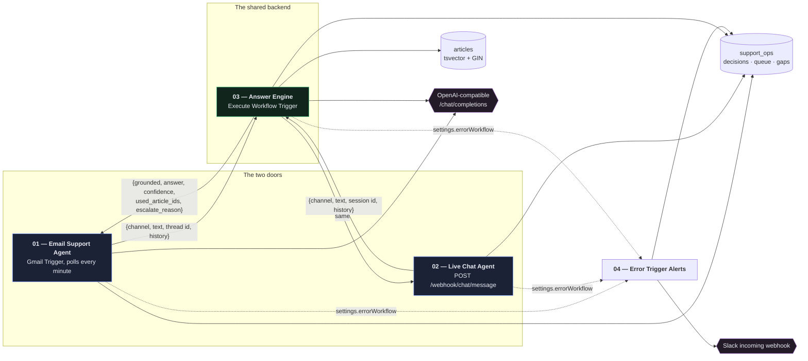
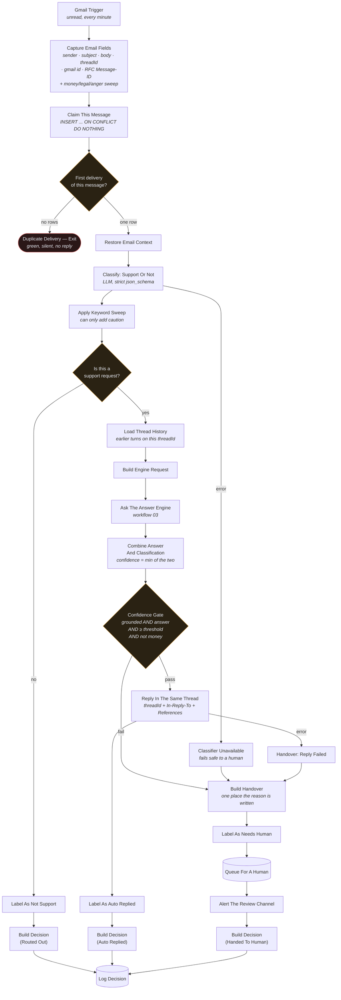
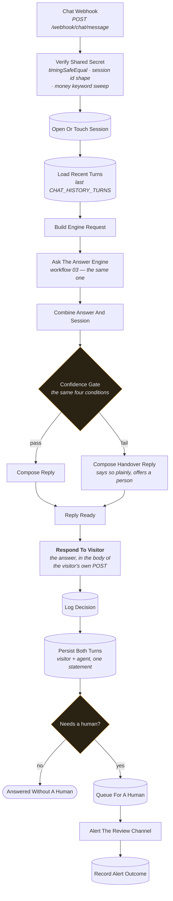
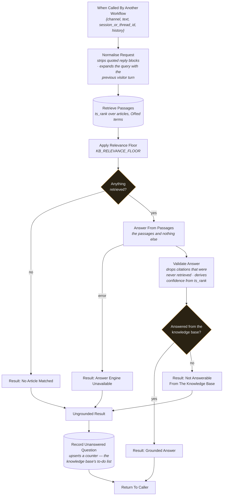
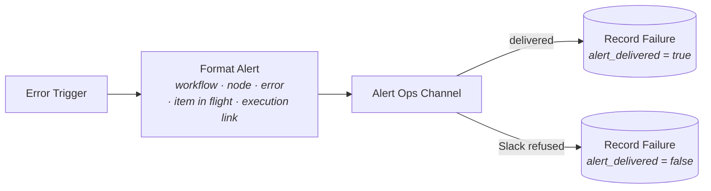
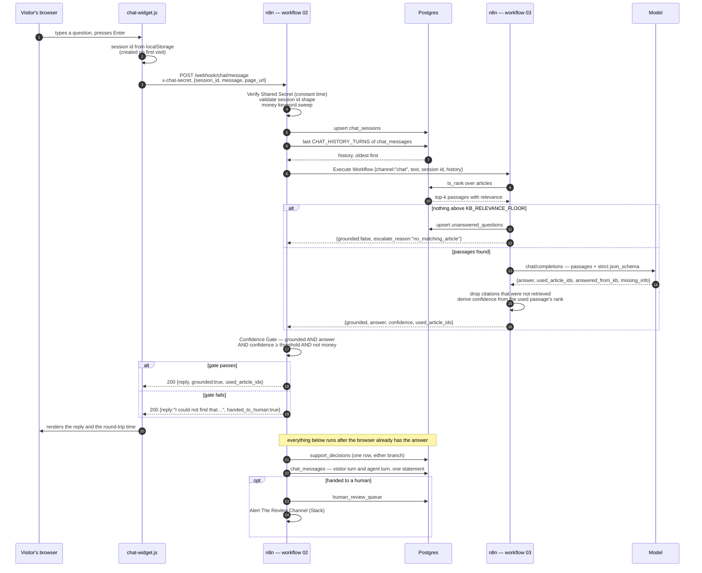

# Process diagram

Four workflows. Two of them are doors — Gmail and the website chat widget — one
is the shared backend both doors call, and one catches everything that breaks.

GitHub renders the Mermaid below directly. If you are reading this in an editor
that does not, paste any block into <https://mermaid.live>.

---

## 1. How the four fit together

The arrow that matters is the one from both doors into **one** box. Workflow 03
is the same n8n workflow id in both cases, not a copy of the same logic — so an
article added, a prompt changed or a relevance floor moved takes effect on both
channels at once, and the two can never drift apart.

---

## 2. Workflow 01 — Email Support Agent

Every Gmail, HTTP and Slack node above has `retryOnFail`, three tries and an
error output. Where the diagram shows one arrow out of `Label As Not Support`,
`Label As Auto Replied`, `Label As Needs Human` and `Alert The Review Channel`,
the file wires **both** outputs to the same next node: a labelling or alerting
failure must not lose the decision row, and the row records what failed.

---

## 3. Workflow 02 — Live Chat Agent

Everything below **Respond To Visitor** happens after the browser already has
the answer. Logging, persistence, the ticket and the Slack alert are not on the
visitor's critical path and should never be.

---

## 4. Workflow 03 — Answer Engine (the shared backend)

`Record Unanswered Question` deliberately writes nothing when the reason was an
outage. A model that was down is not a question the help centre failed to
answer, and mixing the two makes the gap list untrustworthy on the one day
somebody actually reads it.

---

## 5. Workflow 04 — Error Trigger Alerts

Both outputs land on the same node. Slack being down during an incident is not
unusual — it is correlated with everything else being down — and the row has to
be written either way, with a column saying which.

---

## 6. The chat round trip, end to end

Measured on the proof run: **159 ms** from the browser's POST leaving to the
answer being rendered, with nothing injected; **4217 ms** for the same question
when the model endpoint returned HTTP 500 twice before succeeding.
